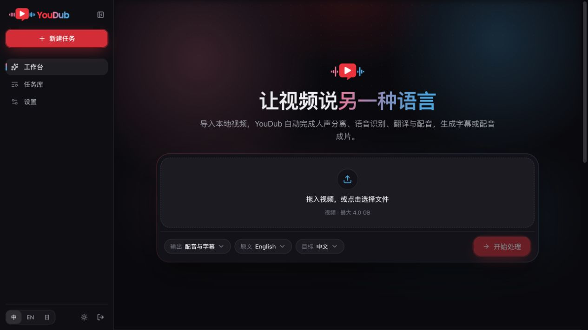
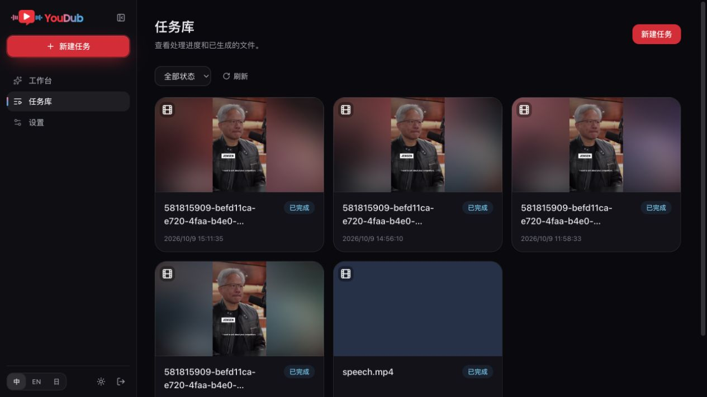
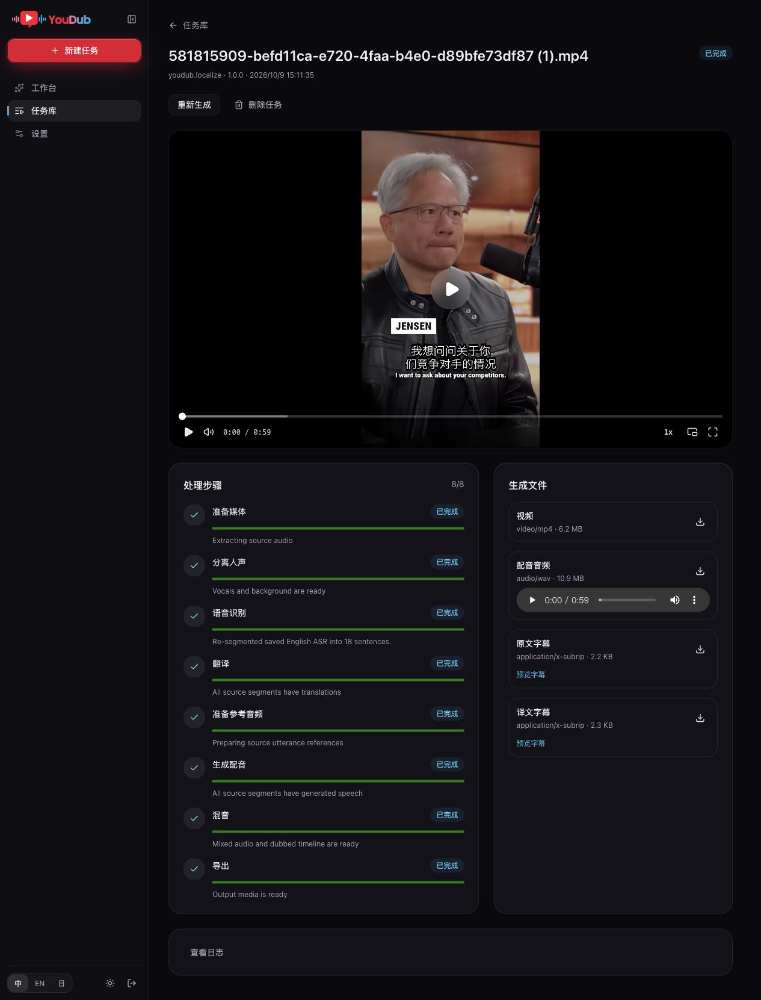

<p align="center">
  
</p>

# YouDub WebUI

开源视频本地化工作台：导入视频，识别、翻译并逐句克隆原声，生成字幕和配音成片。

[English](README.en.md) · [运行与扩展指南](docs/design/cordis-plugin-runtime.md) · [插件开发契约](docs/design/cordis-plugin-contracts.md) · [人才招聘](#人才招聘) · QQ 群：**618246010**

## 界面预览

工作台：导入视频，选择语言和输出内容。



<details>
<summary>查看任务库与任务详情</summary>

任务库：视频封面、处理状态和历史任务。



任务详情：成片预览、处理步骤、配音音频和字幕下载。



</details>

## 能做什么

| 输出模式 | 生成内容 |
| --- | --- |
| 原声 + 字幕 | 保留原始音轨，生成并烧录目标语言字幕 |
| 配音 | 生成目标语言配音，可保留分离后的背景音 |
| 字幕 + 配音 | 输出带字幕的配音视频，可选语音强制对齐 |

- **逐句原声克隆。** 每句译文使用对应原文句子的音频片段作为参考，保留句子与参考音频的一一对应关系。
- **英文分句。** Whisper 识别后使用 NLTK Punkt 整理完整句子，并用词级时间戳确定原声范围；原始识别结果保留。
- **字幕显示。** 按逗号、顿号、中文破折号等拆分显示，合并过短片段，隐藏字幕片段末尾的分隔标点。
- **任务管理。** 查看封面、步骤进度、错误和产物，支持取消、重试、重新生成、播放及下载；API 还支持从指定步骤重新生成。

工作台保留视频、语言和输出模式等基本选项；模型、设备、声音、字幕对齐、背景音默认值及服务连接统一在设置中管理。

## Everything is a plugin

YouDub 使用 **Cordis** 装配服务。任务引擎、默认 workflow、模型提供者、HTTP/API、认证和前端页面都以插件实现；默认组合见 [`youdub.config.ts`](youdub.config.ts)。

```text
Client 页面插件 → API / 认证插件 → 通用任务引擎插件
                                      ↓
                                workflow 插件
                                      ↓
                                provider 插件
                                      ↓
                         Python 计算进程 / 远端服务
```

workflow 声明处理步骤和输入输出，provider 实现约定的 operation，文件通过 ArtifactRef 传递。Python 继续承担媒体处理与模型推理，每次 operation 通过受管进程和 stdio 协议调用；纯 Python 插件也可以直接接入。

替换 ASR、翻译或 TTS 时，提供符合契约的插件即可；新的处理流程可以注册自己的 workflow。架构和边界见[架构说明](docs/design/cordis-plugin-architecture.md)，数据结构见[插件契约](docs/design/cordis-plugin-contracts.md)。

## 快速开始

以下命令面向 macOS / Linux shell；当前真实模型、API 和浏览器验收环境为 **macOS arm64、CPU**。Windows/Linux 实机与 CUDA 尚未在本轮验收，当前配置未提供 MPS。

### 1. 安装依赖

准备 Node.js 22（至少 22.13.0）、Python 3.12、Git、FFmpeg 和 ffprobe。FFmpeg 需要支持 libass/subtitles，且 `ffmpeg` 必须在 PATH 中可用。

```bash
git clone --branch codex/mvp-mainline --recurse-submodules https://github.com/liuzhao1225/YouDub-webui.git
cd YouDub-webui
npm ci --registry=https://registry.npmmirror.com
npm --prefix apps/web ci --registry=https://registry.npmmirror.com
python3.12 -m venv .venv
.venv/bin/python -m pip install --index-url https://mirrors.aliyun.com/pypi/simple/ -r requirements.txt
.venv/bin/python -m nltk.downloader -e punkt_tab
```

已有 checkout 时，执行 `git submodule update --init --recursive` 补齐 Demucs 子模块。已有 `.venv` 时复用环境；仅在 Aliyun 缺包时，改用单一 [Tsinghua 镜像](https://pypi.tuna.tsinghua.edu.cn/simple/)安装缺少的包。

### 2. 配置访问密码

首次创建配置；已有 `.env` 时保留原文件：

```bash
cp .env.example .env
ln .env env.txt
test .env -ef env.txt
.venv/bin/python -c "from getpass import getpass; from pwdlib import PasswordHash; print(PasswordHash.recommended().hash(getpass('YouDub password: ')))"
```

将生成的 Argon2id 哈希填入 `.env` 的 `YOUDUB_AUTH_PASSWORD_HASH`，登录时输入刚才设置的密码。没有默认密码；缺少有效哈希时 Host 会拒绝启动。应用加载 `.env`，代理工具读取同 inode 的 `env.txt`；两者均忽略提交。

### 3. 准备模型

模型权重需要单独准备，设置页只探测本地资产。默认数据目录：macOS 为 `~/Library/Application Support/YouDub`，Linux 为 `~/.local/share/youdub`，Windows 为 `%LOCALAPPDATA%/YouDub`；可用 `YOUDUB_DESKTOP_DATA_DIR` 覆盖。

| 能力 | 默认提供者 | 模型路径（相对数据目录） |
| --- | --- | --- |
| 语音识别 | Whisper | `models/whisper/`，如 `tiny.pt`；另需上面安装的 `punkt_tab` |
| 翻译 | OpenAI 兼容 API | 在设置页配置连接、密钥及模型 |
| 配音生成 | VoxCPM2 | `models/voxcpm/VoxCPM2/` |
| 人声分离 | Demucs htdemucs | `models/demucs/955717e8-8726e21a.th` |
| 字幕对齐（可选） | Qwen3 Forced Aligner | `models/qwen3-forced-aligner/Qwen3-ForcedAligner-0.6B-hf/` |

VoxCPM2 和 Qwen 需要完整的模型与 tokenizer/processor 配置。自定义模型路径和运行条件见[运行指南](docs/design/cordis-plugin-runtime.md#1-安装与配置)。先体验原声加字幕时只需 Whisper 与翻译连接；逐句原声克隆还需要 VoxCPM2 和 Demucs。

翻译密钥保存在系统 keyring。自定义翻译模型候选名单通过 `.env` 中的 `YOUDUB_TRANSLATION_MODELS` 配置，在设置页选择。默认翻译请求的最大输出 token 数至少为 **65,535**，连接的服务和模型需要接受该参数；不兼容时会明确报错。

### 4. 启动

确认 8000、3000 端口没有其他进程占用，然后在仓库根目录执行：

```bash
npm run build:plugins
npm start
```

另开一个终端，在同一目录启动前端：

```bash
npm --prefix apps/web run dev -- --hostname 127.0.0.1 --port 3000
```

打开 [http://127.0.0.1:3000](http://127.0.0.1:3000)，登录后：

1. 在「设置」配置翻译连接，确认所需模型就绪，保存默认处理配置。
2. 在「工作台」导入视频，选择语言和输出模式，创建任务。
3. 在「任务库」查看进度，播放或下载结果。

需要运行构建后的前端时，用以下命令替代开发前端；Host 仍单独运行：

```bash
npm run build:web
npm --prefix apps/web start -- --hostname 127.0.0.1 --port 3000
```

## 安装与开发插件

先完成或取消活动任务，停止 Host，再管理插件：

```bash
npm run plugins -- list
npm run plugins -- install --source ./fixtures/plugins/file-transform
npm run plugins -- disable --id example.file-transform
npm run plugins -- enable --id example.file-transform
```

也支持从其他 GitHub 仓库或 npm 精确版本安装，下面的仓库、commit 和包名需替换为实际值：

```bash
npm run plugins -- install --source https://github.com/OWNER/REPO --ref FULL_COMMIT_SHA
npm run plugins -- install --source npm:PACKAGE_NAME@1.0.0
```

安装默认启用，重启 Host 后生效；带有预编译 Client 入口的扩展刷新页面即可加载。插件安装脚本与 Host 代码使用本机权限，安装前应信任其来源；Python 独立环境用于隔离依赖。

从两个最小示例开始：

- [Host / workflow / Client 插件](fixtures/plugins/file-transform/README.md)：注册处理流程、页面和导航。
- [纯 Python provider](fixtures/plugins/python-text/README.md)：通过 manifest 声明 operation，使用 stdio 输入输出协议。

包结构、文件契约、凭据与取消处理见[插件开发契约](docs/design/cordis-plugin-contracts.md)；安装、启停与卸载见[运行指南](docs/design/cordis-plugin-runtime.md#3-安装启停和重启)。当前 SDK 随仓库提供，尚未作为公共 npm 包发布。

## 当前范围

- 默认流程接收本地 `mp4`、`mov`、`mkv`、`webm` 视频；默认限制 4 GiB、10 分钟、宽高各不超过 1920、60 fps。
- 当前语言目录包含英文、中文、日文，具体能力取决于提供者；可选 Qwen 对齐支持英文、中文。
- MVP 使用单机单活跃任务；插件启停在重启后生效。DAG 编辑器、热替换、插件市场和分布式 worker 留待后续需求。
- 本地 workflow、Client 与 Python 插件已有验证；GitHub/npm 远端插件实装尚未验收。
- 当前 HTTP 接口为 `/api/v2`。旧 FastAPI / v1 HTTP 入口及默认 URL 下载流程已移除。

旧版本升级和数据迁移请先阅读[运行指南](docs/design/cordis-plugin-runtime.md#1-安装与配置)。真实任务、迁移与未验证范围记录在[迁移验收](docs/design/cordis-plugin-migration.md)、[逐句分句验收](docs/validation/asr-punkt-sentences-2026-10-09.json)及[字幕显示验收](docs/validation/subtitle-display-2026-10-09.json)。

## 开发与测试

```bash
npm run typecheck
npm test
npm run test:backend
npm --prefix apps/web test
npm run lint:web
npm run build:web
```

```text
youdub.config.ts    默认 Cordis 插件组合
apps/host/         Host 启动与插件管理 CLI
packages/sdk/      公共服务、workflow 与 operation 契约
packages/builtin/  基础服务、通用任务引擎、workflow 和模型桥
backend/workers/   Python 计算与 SQLite 事务桥
backend/app/       模型、媒体、凭据与历史数据格式
apps/web/          Next 引导、Client SDK 和页面插件
fixtures/plugins/  独立 Host/Client/Python 插件示例
submodule/demucs/   Demucs 源码子模块
```

欢迎通过 Issue / PR 改进安装体验、适配模型、优化字幕与音画对齐，或提供独立来源/流程插件。`docs/` 保留历史设计文档，当前入口以本文和 Cordis 运行指南为准。

## 效果示例

以下是 YouDub 历史生成的英文转中文样例，展示字幕、配音与背景音保留效果。源视频链接用于说明样例出处，当前工作台通过本地文件导入。

### 1. Jensen Huang on Nvidia's Competition

[原视频链接](https://www.youtube.com/shorts/TbotsRXyRME) · YouTube Shorts · 英文 -> 中文

<table>
<tr><th>原始英文</th><th>中文配音版</th></tr>
<tr>
<td>

https://github.com/user-attachments/assets/befd11ca-e720-4faa-b4e0-d89bfe73df87

</td>
<td>

https://github.com/user-attachments/assets/bf01f912-eec8-4e0d-8698-0f69283a73e7

</td>
</tr>
</table>

### 2. How much YT paid me for 129 million shorts views

[原视频链接](https://www.youtube.com/watch?v=ii9Kh4XkA5g) · YouTube 横屏长视频 · 英文 -> 中文 · 下方为开头 40 秒切片，完整版可在 [`demo-assets`](https://github.com/liuzhao1225/YouDub-webui/releases/tag/demo-assets) Release 下载

<table>
<tr><th>原始英文</th><th>中文配音版</th></tr>
<tr>
<td>

https://github.com/user-attachments/assets/bd02936f-cf3c-4e4b-85b5-0410d38f69f5

</td>
<td>

https://github.com/user-attachments/assets/158de60a-7de4-4ddf-b3d8-478d0423aee6

</td>
</tr>
</table>

## 人才招聘

银河智学是一家人工智能教育科技企业，致力于将大模型技术与探究式教学范式深度融合，构建面向 AGI 时代的创新学习体系。

公司官网：[xiaoluxue.com](https://xiaoluxue.com/)

我们正在北京海淀区中关村招聘以下岗位：

- 全栈研发工程师
- 高级 Go 后端架构师（内容平台 / 长任务编排 / AI Agent Runtime）

薪资范围：**30–60K × 13 薪**。

简历投递：[liuzhao@xiaoluxue.com](mailto:liuzhao@xiaoluxue.com)

<p align="center">
  
</p>

## 社区交流

QQ 交流群：`618246010`

<p align="center">
  
</p>

## 开源许可

本项目使用 Apache License 2.0，详见 [LICENSE](LICENSE)。

国内镜像：[AtomGit](https://atomgit.com/liuzhao1225/YouDub-webui)，由 [GitHub 主仓库](https://github.com/liuzhao1225/YouDub-webui)单向同步。Release、Issue 和 PR 在 GitHub 维护。

作者：[刘朝 Zhao Liu](https://liuzhao1225.github.io/) · [GitHub](https://github.com/liuzhao1225) · [Bilibili 黑纹白斑马](https://space.bilibili.com/1263732318)

[Star History](https://www.star-history.com/?repos=liuzhao1225%2FYouDub-webui&type=date&legend=top-left)
