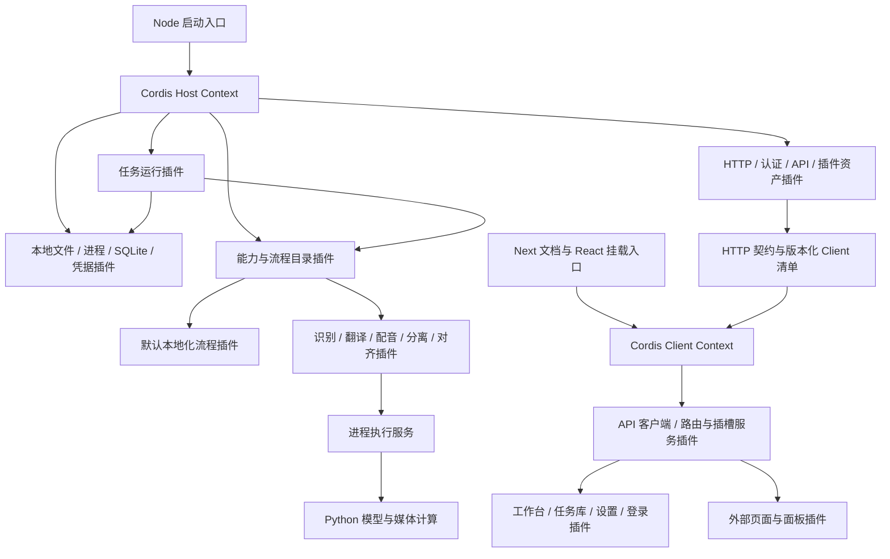

# YouDub Cordis 全插件架构设计

2026-10-09 · 已实施，本地集成验收进行中 · 分支 `codex/plugin`。代码基线为 `codex/mvp-mainline` 的 `e0dcb58dbbbb68ed0d0f92c3810d3e3dbe8a017a`。

本方案将 Cordis 作为服务端和浏览器端的插件底座。任务、存储、凭据、进程执行、模型、处理流程、认证、API 和产品页面全部通过插件装配。官方功能与外部插件使用同一套公开契约。MVP 保留单机、单活跃任务、现有三种输出和三页界面，减少实现数量，同时建立完整的替换边界。

本文件记录已实施的架构边界；准确启动与扩展命令见[Cordis 运行指南](cordis-plugin-runtime.md)，实际验证与待验收事项见[迁移记录](cordis-plugin-migration.md)。现有源码和锁文件是接口依据，设计约束不等同于全部场景已验收。

## Python 主体与 Cordis 的适配判断

Cordis 适合作为本方案的产品装配与生命周期底座，Python 保留模型与媒体实现。跨语言边界应落在粗粒度能力调用上。本地子进程使用 stdin/stdout 和文件通信，远端提供者使用自己的 API；本地模型无需各自监听端口，也无需独立部署为微服务。

截至代码基线，`backend/app` 有 57 个 Python 文件、10,545 行，其中 v1 的 27 个文件、3,840 行包含契约、存储、认证连接、调度和算法适配。统计为源码物理行，含注释和空行，未计测试与子模块，用于说明迁移范围，不能换算为工期。仅替换模型时，Python 原生插件化的迁移成本更低；本方案采用 Cordis 的收益来自任务、流程、基础服务和界面共享插件装配方式。

需要承担的成本是：任务控制逻辑的 TypeScript 迁移、Python 调用协议、双侧契约校验、进程终止与退出验证、插件依赖安装、浏览器共享模块身份。模型推理时间可能远大于 JSON 通信时间，实际冷启动与模型调用开销仍待记录；不能据此省略错误处理和进程测试。

Python 侧仅有薄执行入口与协议读写工具。Host 的 extensions 安装锁决定版本，Cordis 装配已固定模块并管理依赖和启停。多个 Python 虚拟环境分别用于模型依赖；第一版不在 Python 再建插件树、自动恢复管理器或任务调度器。若未来选择 Python 原生宿主，需要单独重新选型；`pluggy` 提供 hooks 与注册机制，其能力范围和 Cordis 的服务依赖、生命周期并不等同。[pluggy 官方机制](https://pluggy.readthedocs.io/en/stable/)

## 1. 架构决策

| 决策 | 本轮选择 |
| --- | --- |
| 插件运行框架 | 使用 upstream Cordis；宿主和插件共享同一版本及实例身份 |
| 服务端宿主 | Node.js / TypeScript，业务能力全部经 Cordis 注入 |
| Python 定位 | 保留媒体与模型计算；通过受管子进程执行，任务状态和调度由 Cordis 服务拥有 |
| 前端宿主 | 保留 Next.js / React；浏览器单独建立 Cordis Context，官方页面也以插件注册 |
| 默认产品 | 一份随应用发布的插件组合，开箱即用；第三方组合可替换其中的实现 |
| 插件粒度 | 按可独立替换的职责拆模块；多个模块可在同一包内交付 |
| 配置生效 | 首版在启动时装配；安装、升级、启停在停止任务并重启后生效 |
| 对外扩展 | 支持独立 GitHub 仓库提供 Host 插件及可选 Client 模块；固定 commit/版本 |
| 数据与任务 | 单份任务状态权威、显式数据库迁移、任务绑定执行版本、失败保留原始原因 |

DeepSeek Harness 将产品能力装配成插件树，通过服务接口、声明依赖和生命周期管理协作；其 UI 使用另行实现的 Slots 服务。[架构说明](https://github.com/deepseek-ai/deepseek-harness/blob/master/docs/architecture.md)、[Cordis Primer](https://github.com/deepseek-ai/deepseek-harness/blob/master/docs/cordis-primer.md)、[UI Slots](https://github.com/deepseek-ai/deepseek-harness/blob/master/docs/subsystems/slots.md)。下文为 YouDub 的设计选择。

## 2. 最底层边界

启动入口只负责定位配置、建立 Cordis Context、挂载 Loader 和选定的插件组合、检查启动结果、接收退出信号并等待释放。框架的服务解析、依赖生命周期和事件机制直接使用 Cordis。

业务代码只能通过注入的服务操作任务、文件、凭据、进程和网络；宿主入口不导入业务数据库、模型、任务循环或页面。空组合只启动框架与诊断能力，不产生产品 HTTP 路由、任务队列或数据库写入。SDK 只包含公共类型、协议及无状态校验，不能隐藏全局 Store、单例调度器或默认模型。

安装目录、配置文件和模块加载属于引导所需的最小宿主能力。加载后，插件管理、产品配置、日志输出和业务文件操作均由相应插件服务负责。业务注册表（模型提供者、流程、页面）同样是普通 Cordis 服务，使用 Cordis 管理自身生命周期。



Host 和 Client 各有一个 Context；服务对象不跨进程传递，Client 通过 HTTP 使用公开契约。每个插件自己的 Cordis 作用域拥有注册和资源。首版使用普通调用上下文传递任务信息与取消信号，无需为每个视频创建第二套依赖容器。

## 3. Cordis 依赖与生命周期

选择 upstream `cordis@4.0.0-rc.10`、`@cordisjs/plugin-loader@1.0.0-rc.7`、`@cordisjs/plugin-include@1.1.0` 作为实施验证基线；发布元数据中的 gitHead 均为 `f8ea3cd50f1a5724e8e715995bcde131c9c12b2c`。根目录 `package.json` 与 `package-lock.json` 已固定这些依赖，Host 使用该版本运行；生命周期与外部浏览器模块分别按迁移矩阵记录验证。上游仍在快速演进，版本更新单独验收。[Cordis 发布元数据](https://registry.npmjs.org/cordis/4.0.0-rc.10)、[Loader 发布元数据](https://registry.npmjs.org/@cordisjs%2Fplugin-loader/1.0.0-rc.7)、[Include 发布元数据](https://registry.npmjs.org/@cordisjs%2Fplugin-include/1.1.0)

DeepSeek Harness 使用重命名到 `@deepseek-ai` 的 vendored Cordis，并维护生命周期等修改。本方案采用 upstream 一套依赖，所有代码示例和生命周期测试以选定版本的源码为准。[Harness vendor 记录](https://github.com/deepseek-ai/deepseek-harness/blob/master/vendor/README.md)

生命周期约定：

- 服务实现使用 Cordis `Service`，消费者通过声明 `inject` 获得服务；禁止直接导入另一插件的实现实例。
- 模型、流程、路由、页面和监听器的注册都返回释放函数，并归属注册插件的 `ctx.effect` 或 Cordis 监听生命周期。
- 一份组合内的单实现服务必须明确唯一提供者。多模型、多流程在领域目录内用唯一 ID 注册；重复 ID 导致装配错误，禁止依靠加载先后覆盖。
- 模块 import 阶段只导出定义；模型加载、端口监听和计时器在插件激活生命周期执行。
- 服务提供者缺失、版本冲突、加载失败均使选定的必需插件不能通过启动检查。未安装的可选能力可以显示未就绪及原因；不能把激活失败报告为启动成功。
- 首版不启用 HMR。运行中变更配置只改变下一次启动的组合，界面分别显示“已保存”和“重启后生效”。

必须核对的 Cordis 实际行为：`ctx.plugin()` 返回可等待的 Fiber；等待结束仍需验证所选插件状态为 `ACTIVE`。Loader 的等待结果不足以证明所有 entry 激活成功，需要审计选定 entry 的 Fiber、依赖及原始错误。关闭时释放宿主持有的应用插件 Fiber，等待子资源退出；根 Context 的 Fiber 在此基线中有 restart 语义，不能作为应用 shutdown API。框架释放返回也不能单独证明子进程已退出，进程服务必须记录实际退出与清理失败。[Fiber 实现](https://github.com/cordiverse/cordis/blob/f8ea3cd50f1a5724e8e715995bcde131c9c12b2c/packages/core/src/fiber.ts)、[Loader 实现](https://github.com/cordiverse/cordis/tree/f8ea3cd50f1a5724e8e715995bcde131c9c12b2c/packages/loader/src)

该版本的 Fiber 会捕获清理异常并记录，不能期待 disposer 抛错自动传播到 bootstrap。宿主须收集所有插件的原始清理诊断；HTTP、存储、监听器或进程中任何资源释放失败，都使整体退出报告失败，已经完成的释放仍如实记录。

## 4. 最小服务与默认插件

下表是逻辑插件模块。首版集中放在一个官方插件包，按 export 分别装配；可独立替换的模块不共享隐式可变全局状态。

| 服务或贡献 | 默认插件职责 | 关键消费者 |
| --- | --- | --- |
| `files` | 本地输入、工作区、产物引用；受管写入与读取占用 | 任务、模型、API 下载 |
| `process` | 启动子进程、结构化通信、stderr、终止并等待整个执行树 | Python 能力、媒体工具、安装器 |
| `store` | SQLite 事务、任务条件更新、设置；拥有 schema 迁移 | 任务、设置、认证相关存储接口 |
| `secrets` | 复用 OS 凭据库命名空间，按引用读取 | 设置、选定远端能力 |
| `catalog` | 注册能力提供者、流程定义、版本与配置 schema | 任务、Runtime、配置界面 |
| `tasks` | `task-runtime` 插件提供任务生命周期、通用 workflow 引擎与单任务调度 | API、任务界面 |
| `settings` | 用户配置、默认选择、凭据引用及任务快照关联 | 流程、API、设置页 |
| `http` | 端口、受管路由和中间件注册；无业务路由 | 认证、API、Client 资产 |
| `auth` | 原有密码、会话、Cookie、CSRF 行为 | API 和界面会话 |
| `api` | 暴露目录、任务、设置和插件管理的 HTTP 契约 | 浏览器、第三方客户端 |
| `extensions` | 包来源、兼容检查、安装状态、下一次启动组合 | CLI、设置页 |
| 默认流程贡献 | 三模式、步骤顺序、跳过条件、时间轴与必要产物 | `catalog`、`tasks` |
| 能力贡献 | 五类模型及 prepare/mix/export 的实际执行 | 默认流程、外部流程 |
| Client 资产贡献 | 同源模块清单及版本化文件；认证后的加载入口 | 浏览器启动器 |

Host SDK 定义基础公共服务，HTTP、auth、extensions 的扩展接口由对应模块声明。基础服务也通过组合选择实现，例如移除 SQLite 默认提供者后，可以挂载另一个符合 `store` 契约的提供者，`tasks` 不应改动。

首版 `task-runtime` 合并任务状态机、workflow 引擎和调度实现，保持一个执行槽，通过 `tasks` 暴露一份公共契约；引擎自身随该普通 Cordis 插件整体替换。远端等待仍占用该任务槽，避免改变现有资源策略。流程目录和模型目录共用一个 `catalog` 服务，按不同贡献类型注册。日志由插件拥有的调用上下文记录，无需新增遥测系统。

### Workflow 的三个插件层次

| 层次 | 插件职责 | 明确边界 |
| --- | --- | --- |
| 通用 workflow 引擎 | `task-runtime` 执行已固定的步骤计划，推进状态、等待、取消与产物提交 | 本身是普通 Cordis 插件，可整体换成同契约实现；Cordis bootstrap 中无任务循环 |
| 业务 workflow | `workflow-localize` 定义三模式、配置、所需能力、步骤计划和必需产物 | 同时安装多个业务 workflow，通过 ID 选择；新增流程无需修改引擎 |
| 步骤提供者 | 模型与媒体插件执行某个有契约的 operation | 提供者不持有任务队列、不决定下一业务步骤 |

最底层的引擎同样能从组合中移除或替换。首版把任务管理和引擎放在一个模块内避免额外协调层；API 对任务生命周期依赖 `tasks` 契约，另使用 files/settings/catalog 等公开服务；业务流程只描述计划，不导入默认引擎。具体类型、状态机、进程线协议与 workflow 示例见[插件契约](cordis-plugin-contracts.md)。

## 5. 模型与流程协议

公共服务接口可由 TypeScript、Python 子进程或远端实现提供。选用什么执行语言由插件决定。以下字段属于 YouDub 公共协议，Cordis 提供服务、依赖和生命周期机制。

Host 协议的类型定义位于[SDK 源码](../../packages/sdk/src/index.ts)，语义见[Workflow 与 operation 契约](cordis-plugin-contracts.md)。计划持有精确 provider binding，步骤用 bindingKey 和 operation 引用它；输入引用前序端口，结果用同名端口返回结构化数据或受管产物。最终成品由计划的 outputs 单独选择发布，诊断文件不自动成为下载项。

流程提供 `describe`、`validate`、`plan`；首版 `plan` 产生可持久化的有序步骤列表。步骤的输入可以引用任务输入或前序步骤的具名输出，绑定由 runner 在执行前解析。框架只理解步骤 ID、输入输出引用、状态与执行接口。`prepare/asr/tts` 等名称、语言限制、声线规则和三种输出模式归默认流程与能力插件。

所有新任务存储流程 ID/版本、规范化配置、步骤计划、提供者与模型绑定、连接及凭据引用。已有任务不能通过当前默认模型或当前流程重新推导执行计划。首版可要求插件升级前处理完活动任务；旧版本不存在时，历史详情和产物仍可读取，重试明确报告版本不可用，用户可用当前配置创建新的任务。

模型契约需要覆盖：

| 能力 | 结果约束 |
| --- | --- |
| ASR | 完整 utterance 的稳定 ID、源时间戳、语言；可选标准词时间戳与 speaker；raw 原样另存 |
| Translation | 每个 segment ID 对应一条完整译文；保留原顺序和文本语义单元 |
| TTS | 每条完整译文对应完整音频，报告采样率、声道、样本数及实际时长 |
| Separation | 人声与背景保持约定的源音频时长、采样率、声道和起点 |
| Alignment | 输入实际配音及匹配文本，输出词级相对时间戳，明确时间单位和基准 |
| Media | prepare、mix、export 各有自己的输入输出 schema，时间轴处理由实现负责 |

默认流程保留现有“整句 TTS、字幕独立分段”的规则。配音参考选择只能读取标准 transcript 词时间戳；缺少必要能力时在配置或执行时明确拒绝，供应商 raw 仅供诊断。Python operation 桥将标准 transcript 交给参考处理；具体实现见[计算桥](../../backend/workers/operations.py)、[参考选择](../../backend/app/v1/tts.py)和[分段契约](../../backend/app/v1/segments.py)。

### 配音替换示例

默认组合登记 VoxCPM；IndexTTS、MiniMax 仅作为后续适配场景，不列为已实现。TTS operation 接收 transcript、translation 和可选 references，返回 speechAudio；具体字段与 JSON Schema 见[媒体契约](../../packages/builtin/src/media-contracts.ts)。本地提供者经 Python 执行桥运行，远端提供者也可由 TypeScript 实现同一 operation 并注册受管音频。

每个提供者另行声明语言、预设声线、参考音频、参考文本、音频时长和输入长度要求。界面只允许兼容选择，流程在提交前校验组合；不假设三者具有完全相同的克隆能力。协议固定输入输出语义，特有参数放入有 schema 的 `options`。若需要不同模型能力，插件可以声明新契约版本，禁止在已有字段中偷偷改变语义。

阶段开始前验证输入契约，完成后验证声明的必需输出；退出码 0 或存在某个文件均不足以标记成功。额外输出保留原名和 MIME，通用产物服务只接受任务工作区内的受管文件。

## 6. Python 和远端执行

Node Host 中的 Cordis `tasks` 服务是唯一调度和状态推进者。Python 调用端不启动 FastAPI、旧 worker 或 `run_task`，不扫描队列，不写 Task 状态。现有算法函数可逐步提取复用；不能通过包装 `backend.app.main:app` 完成最终切换。[当前启动与分派](../../backend/app/main.py)、[当前执行器](../../backend/app/v1/executor.py)

首版使用受管标准输入输出通信：每行一个 JSON 消息，音视频通过工作区文件引用交换。envelope 带 `version / invocationId / seq / type / payload`，execute payload 包含 taskId、attempt 和 stepId。stdout 只承载协议；原始库输出和诊断走 stderr。按一次步骤启动 Python，步骤内部可处理整批 utterance，无需每句话启动模型进程。

协议只需要请求、进度、外部请求状态、结果、错误和取消。父进程校验请求关联、消息顺序与输出；坏 JSON、异常退出、缺结果立即使当前调用失败并保留 stderr。官方 Python 依赖共用现有 `.venv`；外部重模型插件可指定其安装目录中的独立 `.venv`。分发包和 manifest 不写死开发机器路径；执行 payload 中的输入路径由当前 Host 解析，产物描述符使用调用工作区内相对路径。

`store` 首版由一个 Cordis 插件提供，复用 Python sqlite3 的表结构与 SQL，通过其拥有的单个受管持久进程执行存储操作；该进程按请求串行执行，每次调用完成完整事务。调用边界是创建带快照的任务、条件更新、分页查询和迁移，事务不能拆成多次远程读写。数据库句柄不暴露给其他插件，进程崩溃直接报告存储不可用并停止领取。调度决定只在 `tasks`。此方案避免首次重构同时更换 SQLite 驱动和数据格式，后续替换 Node 实现只替换提供者。

`secrets` 首版通过窄 Python keyring 调用保留 `YouDub` 服务名与原引用；认证哈希校验也可复用纯 Python 调用。每个调用仅接收所需参数，使用同一 `process` 服务，无需新增 HTTP 服务。存储进程和模型进程各自按工作负载拥有生命周期；模型进程无数据库访问入口。设置与凭据跨介质部分写入继续显式返回部分完成状态，禁止隐藏或自动重试。

远端请求在发出前，由 Host 持久化请求键及 pending，再给执行端发送确认；执行端收到确认后才能调用供应商。响应、operation ID 和 unknown 状态必须保留。读取超时、断连或进程退出后，未确认的请求按 unknown 展示，不能自动再发。调用外部 LLM 时显式校验输出上限至少 65,535；供应商拒绝该上限则直接报告不兼容。

取消先停止本机推进并终止子进程树，等待退出后写入最终状态。远端未确认停止时保留 `mayStillRun`，禁止普通 retry。插件卸载不能直接把运行中的任务写成 cancelled。当前取消不自动请求供应商撤销，未确认的请求按 unknown 保留。正常停机先停止领取，再取消/等待执行；强制退出留下可辨识的中断状态，下次启动明确报告。旧 attempt 的迟到进度或结果通过条件更新拒绝。

## 7. 前端同样以 Cordis 为底座

Next 保留 document、静态资源、React 根挂载和固定 catch-all 路由。产品页面、导航、会话、主题、语言、任务配置和详情展示分别作为 Client 插件贡献；共享 UI primitive 和 CSS token 作为无状态库复用。登录页也由插件提供，未认证时只加载公开启动清单，认证后加载所选产品清单。

Client 默认提供 `apiClient`、`navigation`、`slots` 和会话服务。首版 Slots 只实现有 ID 的页面和列表插槽，支持明确顺序和释放；复杂优先级覆盖、任意组件树重写后置。插件只能依赖公共服务与 SDK 类型，禁止导入另一个页面插件的组件或 Next 私有上下文。

最小插槽：唯一 `root`、`shell.navigation`、`shell.routes`、`settings.sections`、`task.detail.panels`、`task.detail.actions`，另提供按 workflow/provider ID 索引的 `config.editors`。默认工作台、任务库、设置页也经这些接口注册。路由由宿主的 optional catch-all 承载，安装插件无需生成新的 Next 文件路由。插槽输入、路由和会话生命周期见[Client 契约](cordis-plugin-contracts.md#10-client-装配与界面注册)。

产品数据契约改为：

- 配置：流程 schema、默认值、模型目录及校验诊断；标准控件渲染 schema 的已支持子集，后端最终校验。
- 步骤：该任务创建时固定的实际步骤与每步状态，前端不再根据七阶段位置推断完成。
- 产物：列表包含 ID、名称、MIME、角色和下载地址；视频/音频/字幕有默认预览，其他类型提供明确文件下载。
- 操作：首版后端返回 cancel/retry/rerun/delete 四类可用任务动作；通用生命周期统一。插件额外按钮调用自己的公开 API，不能绕过 tasks 修改任务状态。通用自定义任务动作协议后置。
- 就绪：区分插件已安装、已启用、已激活、模型前置条件满足；Runtime 的“可用”不宣称真实供应商请求已成功。

新 Client 使用[通用 HTTP 类型](../../apps/web/src/plugin/contracts.ts)呈现 workflow 描述、steps 和 outputs；默认视频配置编辑器作为官方插件贡献，复用[现有配置表单](../../apps/web/src/components/v1-task-config.tsx)。

### Client 模块交付

采用一条加载路径：插件仓库发布预编译 ESM Client 入口，安装器将其放到本地版本目录，HTTP 资产插件从同源版本化 URL 提供，浏览器启动器按清单原生动态 import。官方页面使用相同清单和模块 ABI。刷新后加载新组合，不做运行中的代码热替换。

React、ReactDOM、JSX runtime、Cordis 和 SDK 使用宿主公开的平台模块，外部构建将它们标记为 external。选择 HTML import map 加同源平台 ESM 桥这一种解析方式，固定 specifier 和加载顺序见[Client 契约](cordis-plugin-contracts.md#10-client-装配与界面注册)。平台桥只导出宿主已有实例及明确的公共 API；插件不得自带第二份 React/Cordis。Client manifest 的 SDK/platform 版本不兼容时拒绝加载。第三方入口通过已安装的同源资产提供。插件自带编译后的、限定作用域的 CSS 并复用设计 token，主程序的 Tailwind 构建不负责扫描未来安装的插件。

Next 当前依赖文档提供 `webpackIgnore` / `turbopackIgnore` 的运行时 import 机制；它仅解决跳过打包，不能代替共享模块身份、资源发布和插件生命周期。P0 必须用当前生产构建证明“外部模块发布后，主程序无需重建即可加载”，并验证 hook、共享 context 和卸载。验证失败时停在此接口修正，不改为要求每个用户重新构建主程序。[Next 加载指南](https://nextjs.org/docs/app/guides/lazy-loading#magic-comments)

## 8. 外部 GitHub 插件

首版一个 npm 包可以有 Host、Client 和 Python 资产。包通过 `youdub.host` 指定 Host 入口，通过其余 `youdub` 元数据声明 SDK 兼容范围、Client 入口和可选 Python 依赖文件。当前字段为 `youdub.id/sdkVersion/host/client/python/build`，准确示例见[运行指南](cordis-plugin-runtime.md#4-最小插件包)。普通 npm 包缺少有效声明时不能启用。

纯 Python 模型扩展可以复用官方 `python-provider` Cordis 插件模块，在 manifest 中声明计算入口和能力契约，作者只编写 Python 实现及元数据。这个桥接模块按插件实例分别注册提供者并拥有进程，Python 侧无需实现第二套插件系统。Client 界面可以附带预编译 JavaScript。当前包的 `host` 与 `python` 入口互斥；自定义流程通过 Host 插件实现，并调用公开进程服务。

```text
youdub-plugin-example/
  package.json          # exports、peerDependencies、youdub 元数据
  dist/host.js          # Cordis 插件定义
  dist/client.js        # 可选的预编译 Client 入口
  python/               # 可选计算程序
  requirements.txt      # 可选的 Python 依赖
  README.md             # 配置、兼容范围、示例
```

安装器接受 GitHub 仓库与 ref、发布包或本地包；将 ref 解析并固定为 commit，记录包完整性和实际版本。Git 来源须带可安装的构建产物或明确构建入口。安装器校验元数据与兼容范围，安装和构建步骤记录在该次安装日志中。只有包、依赖和契约检查全部通过才能标记 installed；enabled 和 active 单独报告。

安装失败停在失败阶段，报告已产生的文件和未完成步骤；不能静默换源、降版本或把残留目录当作安装成功。安装流程遵守仓库既定 npm/pip 源规则。外部插件的 Host 代码以本机权限运行；独立 Python 环境只隔离依赖。当前管理接口显示来源、版本和启用状态；安装授权包含该来源的依赖及构建执行，不引入插件权限沙箱。

内置插件由应用包提供，不复制为可变代码；外部插件进入用户数据目录。启用配置以插件模块引用装配二者。插件目录只存软件与环境，任务/产物目录独立；卸载插件不会删除用户视频、历史或产物。凭据继续在系统凭据库，配置和安装日志只保留引用。

## 9. MVP 仓库布局

```text
apps/
  host/                 # Cordis 启动入口与管理 CLI
  web/                  # Next 引导、Client SDK 与官方页面插件
packages/
  sdk/                  # 类型、协议、无状态校验和构建约定
  builtin/              # 官方 Host 插件，各模块可独立装配
backend/
  workers/              # Python 计算与窄基础服务调用
fixtures/plugins/       # 独立扩展示例
youdub.config.ts         # 默认 Host 插件组合
```

以上布局已实现。首版沿用 npm 和 Node.js 22，不增加 monorepo 调度框架。运行数据仍放用户目录；外部插件选择与固定包身份写入 `extensions/installed.json`，项目依赖使用 npm 锁文件，官方组合使用 `youdub.config.ts`。避免再建立插件数据库、工作流 DSL、市场服务、分布式调度、全量事件溯源或通用 RPC 框架。

完成底层插件化的判断：禁用默认流程后可安装外部流程；替换存储提供者无需改任务插件；移除官方 ASR 后其注册消失；新增 Client 页面无需改主程序源码。上述变化都通过相同 Cordis 生命周期和公开契约实现。
