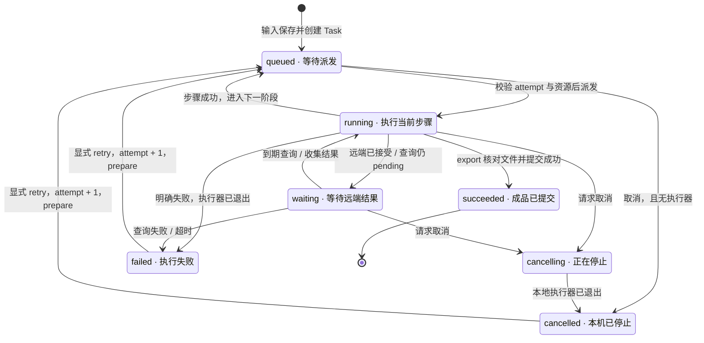

# YouDub Windows MVP：接口与流程主干

配套传输契约：[OpenAPI 3.1](youdub-api-v0.1.openapi.json)；[SQLite DDL](youdub-schema-v0.1.sql)。[飞书正文](https://my.feishu.cn/docx/Nm3bdG4CGoDu6gxvMSmcOp43nWd)。

2026-09-22 · MVP 主干版 · 接口与流程评审稿。先完成单视频闭环，再根据真实效果进行优化。

本轮定义模块边界、处理流程、状态、数据结构与 HTTP 契约。独立 youdub-backend 作为媒体处理主要参考；详细实现、性能优化和具体故障案例后置。

## MVP 范围与模块架构

目标：先跑通“导入一个本地视频 → 识别 → 翻译 → 配音或字幕 → 预览与导出”。首版同时执行一个 Task，其它任务排队。保持一个本机业务后端、一份 SQLite、三个业务模块。

| 模块 | 输入 | 输出与职责 |
| --- | --- | --- |
| 任务管理 | 创建、查询、取消、重试、重新生成 | 保存 Task 与固定配置；按顺序派发步骤；返回进度、错误与成品入口 |
| 视频处理流程 | 输入视频、固定配置、当前步骤 | 定义七阶段及跳过条件；组织音频、字幕与视频处理；返回步骤结果 |
| 模型适配 | 音频或文本、模型选择、声音方式 | 统一分离、ASR、翻译、TTS 的调用与返回结构 |

### 模块关系

[组件架构图](https://my.feishu.cn/docx/Nm3bdG4CGoDu6gxvMSmcOp43nWd#doxcnlqgfjTBCyabIEi1SZVzOcg)

下图用于说明组件职责。首版复用现有 Python 媒体处理和 Web 界面；桌面宿主、进程驻留与资源调度的具体实现，在主流程跑通后根据实测确定。

### 本轮边界

- 保留：本地视频、单 Task、三种输出模式、基本进度、取消、从头重试、预览与下载。
- 媒体流程主要参考独立 youdub-backend；前端与 HTTP 改造参考 YouDub-webui；OpenCreator 作为执行上下文和接口组织的补充参考。
- 本轮不展开：多任务性能优化、缓存复用、逐句重做、细粒度调度、复杂故障恢复、广告裁剪、整体倍速和多平台投稿。
- 先定义输入、输出和状态，再用真实视频验证闭环；降噪、对齐策略、模型常驻与加速等优化依据效果逐项决定。

## 处理流程与输入输出

```text
prepare → separate → asr → translate → tts → mix → export
```

| 阶段 | 输入 | 输出 |
| --- | --- | --- |
| prepare | 原视频 | 媒体信息、源音频 |
| separate | 源音频 | 人声、背景音；按模式决定是否执行 |
| asr | 人声或源音频、源语言 | 原始转写、带稳定 ID 和时间戳的分段 |
| translate | 原文分段、目标语言 | 按 segment_id 对应的译文 |
| tts | 译文、声音选择、必要的参考音频 | 分段音频及实际时长 |
| mix | 分段配音、时间轴、可选背景音 | 最终音轨、配音时间轴 |
| export | 源视频、字幕、最终音轨 | 可预览和下载的 MP4、WAV、SRT |

### 输出模式

| 模式 | 成品 | 流程约定 |
| --- | --- | --- |
| subtitles | 原文 SRT、译文 SRT、保留原声并烧录译文的 MP4 | 跳过 separate、tts、mix；两份字幕均使用源时间轴 |
| dubbing | 最终混音 WAV、无烧录字幕的配音 MP4 | 执行 TTS；按 keep_background 决定是否保留背景 |
| both | 两份 SRT、最终混音 WAV、带译文字幕的配音 MP4 | 原文字幕用源时间轴，译文字幕用配音时间轴 |

保留背景音或克隆源音色时需要分离；预设声音且不保留背景时，目标流程允许跳过分离。声音克隆仅对适配器明确支持的模型开放。audio 成品代表与视频一致的最终音轨。

### 统一的数据约定

- 时间统一为整数毫秒，区间为 [start_ms, end_ms)。源分段保留文本、顺序、时间戳和说话人；只归一化字段并补充稳定 ID。
- 翻译通过 segment_id 对应原分段；TTS 返回实际音频时长；mix 单独生成配音时间轴。配音排程不覆盖原始 ASR 时间戳。
- 桌面首版保持原视频画面时间轴，不加入广告裁剪或整体倍速。分段对齐的具体算法先复用并验证，再根据效果优化。

独立 [YouDub Backend](https://github.com/liuzhao1225/youdub-backend) 的当前本地实现直接使用 ASR 原始 utterances；asr_fixed.json 是兼容文件名（pipeline_stages.py:433）。原 merge_audio / merge_video 包含服务端业务策略，桌面按本节输入输出选取可复用函数，不把整套服务端流水线直接接入。

## Task 数据模型与状态

核心业务对象只有 Task。创建时固定本次配置，修改默认设置只影响新任务；同配置重试复用 Task，换配置重新生成新 Task。

| 字段组 | 主要字段 | 含义 |
| --- | --- | --- |
| 身份与输入 | id、source_name、source_size_bytes、source_duration_ms | 一个视频对应一个 Task；时长在 prepare 前可为空 |
| 本次执行 | attempt、status、current_stage、stage_progress | attempt 初始 1；阶段进度为 0–1，无法测量时为 null |
| 界面提示 | wait_reason、message、error、allowed_actions | 显示等待原因、错误与当前可用操作 |
| 固定配置 | config、pipeline_version、resolved_connections | 模型、设备、语言、声音、输出选项及脱敏连接快照 |
| 结果 | outputs、external_operation | 最终文件描述；远端请求状态与是否可能仍在运行 |
| 时间 | created_at、updated_at、started_at、finished_at | UTC RFC3339 毫秒格式 |

### 任务状态图



queued 表示等待派发，waiting 表示远端已接受并等待结果。成功时 current_stage=done；失败或取消保留最后阶段。重试从 prepare 开始，attempt 加一。

图中的取消完成表示本机已停止推进；远端状态通过 external_operation 独立返回。完整字段必填性、可空规则与枚举见 OpenAPI 附件。

### 步骤执行协议

```text
execute_stage(context) -> StepResult

context = { task_id, attempt, stage, config, input_files, work_dir }
StepResult =
  { state: "completed", output_files }
  | { state: "waiting", remote_task_id, next_poll_at }

progress = { task_id, attempt, stage, progress, message }
error = { code, message, field, stage, action }
```

任务管理负责更新状态；处理流程与模型适配返回进度、结果或错误。远端异步步骤区分 submit / poll，保存外部任务 ID 后查询同一请求。该边界参考独立后端的 StageExecutionContext / StageExecutionResult（stage_pipeline.py:265）。

## 模型适配接口

| 接口 | 输入 | 统一输出 |
| --- | --- | --- |
| separate | audio、model | vocals、background |
| transcribe | audio、language、model | detected_language、segments |
| translate | segments、source、target、model | 带 segment_id 的译文列表 |
| synthesize | text、voice、model | segment_id、path、duration_ms、sample_rate_hz、channels |

本地模型和远端 API 使用同一能力边界。模型实现内部处理供应商字段；流程层只使用统一结构。声音模式为 preset 或 source_clone，适配器声明自己实际支持的模式。

GET /runtime 返回可用设备、模型、语言、声音方式和输入限制。前端依据目录展示选项；未接入或不可用的模型不允许创建任务。正式 VoxCPM2 API 规范尚待提供，示例中的 demo_* 只用于 Mock。

### 内部媒体结构

```text
Segment = { id, start_ms, end_ms, text, speaker_id? }
Translation = { segment_id, text }
SpeechClip = { segment_id, path, duration_ms, sample_rate_hz, channels }
AlignedSegment = {
  segment_id, source_start_ms, source_end_ms,
  dubbed_start_ms, dubbed_end_ms
}
```

## HTTP 接口与请求示例

业务前缀 /api/v1；复用 /api/auth 登录与会话。业务请求使用 youdub_session Cookie，写请求携带 X-CSRF-Token。JSON 使用 snake_case。成功返回资源本身；列表返回 items、limit、offset、has_more。

| 方法与路径 | 成功 | 行为 |
| --- | --- | --- |
| GET /api/health | 200 | 读取本机服务就绪状态 |
| POST /api/auth/login | 200 | 沿用现有密码登录 |
| GET /api/auth/session | 200 | 读取会话与 CSRF token |
| POST /api/auth/logout | 204 | 撤销会话 |
| GET /api/v1/runtime | 200 | 读取实际可用模型、设备和输入/并发限制 |
| GET /api/v1/settings | 200 | 读取默认值和脱敏连接 |
| PATCH /api/v1/settings | 200 | 更新一个配置分组 |
| POST /api/v1/tasks | 201 | 导入本地视频、固定配置并入队 |
| GET /api/v1/tasks | 200 | 分页查询任务摘要 |
| GET /api/v1/tasks/{id} | 200 | 读取任务详情 |
| DELETE /api/v1/tasks/{id} | 204 | 删除终态 Task 或无记录的同 ID 导入残留 |
| POST /api/v1/tasks/{id}/cancel | 200/202 | 停止当前任务的本机处理 |
| POST /api/v1/tasks/{id}/retry | 200 | 原配置从头重试，attempt 增加一次 |
| POST /api/v1/tasks/{id}/rerun | 201 | 复制原视频并以新配置创建独立 Task |
| GET /api/v1/tasks/{id}/files/{kind} | 200/206 | 预览或下载完整产物 |
| HEAD /api/v1/tasks/{id}/files/{kind} | 200 | 查询文件大小与类型 |
| GET /api/v1/tasks/{id}/log | 200 | 读取脱敏任务日志 |

### 创建 Task

POST /api/v1/tasks 使用 multipart/form-data：id 为客户端生成的 UUID，file 为视频二进制，config 为 application/json 部件。201 表示输入已保存并排队。网络中断后保留同一 id；已创建返回 409 TASK_EXISTS，客户端转为查询原 Task。

```json
{
  "source_language": "en",
  "target_language": "zh",
  "output_mode": "both",
  "keep_background": true,
  "asr": {
    "adapter": "demo_asr",
    "model": "demo-asr",
    "device": "remote"
  },
  "translation": {
    "adapter": "demo_translation",
    "model": "demo-llm",
    "device": "remote"
  },
  "tts": {
    "adapter": "demo_tts",
    "model": "demo-tts",
    "device": "remote",
    "voice": {
      "mode": "preset",
      "id": "demo-voice"
    }
  },
  "separation": {
    "adapter": "demo_separation",
    "model": "demo-separation",
    "device": "cpu"
  }
}
```

subtitles：tts/separation 为 null，keep_background=false。配音模式：tts 必填；保留背景或克隆源音色时 separation 必填，其余情况为 null。模型和设备选择必须来自 /runtime。

### 查询与结果

列表默认 limit=20、最大100，按创建时间倒序；active=true 返回非终态任务，不能与 status 同传。前端首版每 2 秒轮询，显示当前阶段与进度。详情返回上一节定义的完整 Task；下面是输出文件对象示例：

```json
{
  "audio": {
    "url": "/api/v1/tasks/8d129c98-8e49-4afb-af3a-0b4da4a5533f/files/audio",
    "file_name": "audio.wav",
    "mime_type": "audio/wav",
    "size_bytes": 4096,
    "duration_ms": 120000,
    "timeline": "dubbed"
  }
}
```

files/{kind} 的 kind 为 video、audio、source_subtitles、translated_subtitles。download=true 下载；默认预览。video/audio 支持单段 Range；HEAD 返回文件元信息。

### 取消、重试与重新生成

| 动作 | 请求 | 结果 |
| --- | --- | --- |
| cancel | 无请求体 | 202 表示已接受停止；任务已终态时返回 200 当前 Task |
| retry | {"expected_attempt":1} | 失败/取消任务以原配置从头执行；成功后 attempt=2；重复同一请求返回已有新 attempt |
| rerun | {"id":"新 UUID","config":{...},"acknowledge_external_risk":false} | 终态源任务的输入副本加新配置，创建独立 Task |
| delete | 无请求体 | 删除终态 Task 及应用内文件；成功返回204 |

外部结果仍未知时不直接重复提交；rerun 通过 acknowledge_external_risk 表示用户知悉原请求可能仍在执行。首版只定义动作边界，故障处置的具体实现随主流程联调收敛。

### Runtime 与 Settings

| 接口对象 | 主要字段 | 用途 |
| --- | --- | --- |
| Runtime | devices、capabilities、limits、status | 已接入能力、输入上限、当前运行状态；首版活动任务上限为1 |
| Settings | defaults、connections、ui_language | 新任务默认值、脱敏连接信息与界面语言 |
| Settings PATCH | defaults / ui_language / connection 三选一 | defaults 整组替换；connection 更新一个 adapter |

api_key 为只写字段：省略保留，非空字符串替换，null 清除，空字符串拒绝；GET 返回 has_api_key。界面语言为 en / zh / ja，与模型实际支持的媒体语言分别定义。

### 错误返回

```json
{
  "error": {
    "code": "MODEL_NOT_READY",
    "message": "The selected model is not available.",
    "field": "config.tts.model",
    "stage": null,
    "action": "adjust_settings"
  }
}
```

HTTP 使用 401/403 表示会话或访问校验，404 表示资源不存在，409 表示状态冲突，413/415 表示输入限制，422 表示参数无效，500/503/507 表示执行环境或存储错误。Task 已创建后的处理失败写入 Task.error，查询仍返回200。完整 schema、错误枚举与示例以 OpenAPI 附件为准。

## 数据与配置存储

| 数据 | 位置 | 职责 |
| --- | --- | --- |
| Task状态、配置、产物索引 | SQLite tasks | 任务管理统一写入 |
| 默认配置与连接引用 | SQLite settings | 新任务创建时读取 |
| 原视频、中间文件、成品 | tasks/{id}/input、work、output | 每个 Task 独立目录 |
| 模型权重 | models/ | 本地适配器读取 |
| 供应商密钥 | 系统凭据存储 | SQLite 与 Task 只保存引用 |

保留 tasks/settings 两张业务表，认证沿用现有机制。原视频和媒体产物放文件系统；不新增 Run、StageJob 或 Artifact 业务表。每个任务固定本次配置，成品生成并核对后登记 outputs。

桌面首版使用独立用户数据目录与新库。当前服务端 Supabase 表、独立阶段服务和发布回执不直接迁入；旧 WebUI 数据保留原语义。附件 DDL 仅描述空库目标结构。

## 首版联调与验收

实施顺序：先按 OpenAPI 对齐前后端 Mock，再接入一条真实可用的模型组合，完成单视频端到端闭环。协议和主干稳定后，再根据实际效果、耗时与资源占用决定优化。

- 接口可联调：创建、查询、基本进度、取消、重试、重新生成、结果预览与下载都能对应到明确状态。
- 流程可完成：同一真实视频通过 subtitles、dubbing、both 三种模式，得到约定产物。
- 结果可检查：视频能播放，原声/配音符合模式，字幕与相应时间轴匹配，末尾内容完整。
- 状态可理解：缺模型、处理失败和用户停止有明确反馈；更改默认值不会改变已创建 Task 的配置。

联调前需确定：默认模型与语言方向、声音模式、Windows 参考机器、输入文件上限，以及远端接口的请求/响应规范。没有真实样例证据的模型能力保持不可用。

本轮收敛范围：不写调度 SQL、进程回收参数、竞态穷举、复杂重启恢复矩阵、性能 SLA 或具体降噪/对齐调优方案。它们在主干运行后，按实际问题进入下一轮设计。当前文档是接口与流程草稿，尚未代表 Windows 或模型实机验收通过。

## 参考依据与接口附件

| 来源 | 本轮用途 | 核对范围 |
| --- | --- | --- |
| [YouDub Backend](https://github.com/liuzhao1225/youdub-backend) | 媒体流程、阶段输入输出与异步模型调用的主要参考 | 按用户说明承载黑纹白斑马运行代码；本轮只核对本地源码 3ef9ef2a2fdb9060ab9b8276a916572f2ee9d5cb，未做生产在线验证 |
| [YouDub WebUI](https://github.com/liuzhao1225/YouDub-webui/tree/d90e1c257104d69fedbc70d7935c7337e45a0950) | 现有前端、HTTP、认证和桌面交互改造 | 固定提交 d90e1c2；WebUI/backend 与独立 youdub-backend 分开标记 |
| [OpenCreator](https://github.com/krillinai/OpenCreator/tree/a153ac073e6d03b55a142266aadce3d82109b37f) | 执行上下文、任务动作和能力目录的补充参考 | 固定提交 a153ac0；首版维持单 Task 与三个业务模块 |
| [YouDub 爆款案例孵化方案](https://modelbest.feishu.cn/docx/MsuudcxtUoAkXuxoCv0cYF1Tnec) | Windows、单视频 Beta、英文优先与接口交付要求 | 需求输入；实现与验收状态分别确认 |

后端本地核对位置：stage_pipeline.py:51 的九阶段定义、:265 的执行上下文/结果；pipeline_stages.py:350 的 ASR 提交/查询、:433 的原始分段保留；audio_merger.py 与 video_merger.py 的配音/合成边界。本地提交 3ef9ef2 尚未在 GitHub 找到，故本节不提供指向该提交的失效深链。

桌面七阶段按本地导入与成品导出的目标重新划分。后台下载、投稿、发布后处理不进入首版流程；服务端已有降噪、广告与倍速策略按本产品范围重新选择。

补充规范：[SQLite 事务](https://sqlite.org/lang_transaction.html)、[SQLite WAL](https://sqlite.org/wal.html)、[OpenAPI 3.1](https://spec.openapis.org/oas/v3.1.0.html)。

### 接口附件

[youdub-api-v0.1.openapi.json](youdub-api-v0.1.openapi.json)

[youdub-schema-v0.1.sql](youdub-schema-v0.1.sql)

OpenAPI 3.1 保留完整传输定义：17 个 HTTP 操作、32 个 schema。正文只展开主干与关键示例，附件中的字段和动作语义继续作为联调草案；它们不要求本轮实现具体的性能或算法优化。SQLite DDL 仅用于新库结构核对。两份附件版本均为 0.1.0-draft.1。
